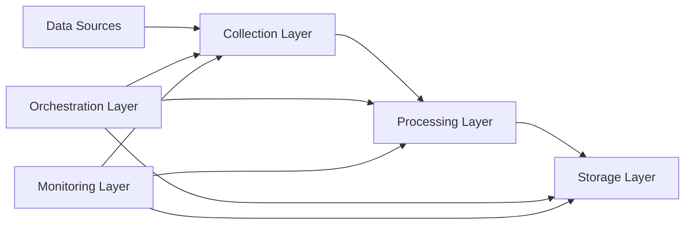

# docs/README.md
# Financial Time Series Data Ingestion Pipeline

## Overview
A scalable, robust pipeline for ingesting, processing, and storing financial time series data from multiple sources. The pipeline supports real-time and batch processing, with comprehensive monitoring and error handling.

## Table of Contents
1. [Architecture](architecture.md)
2. [Installation](installation.md)
3. [Configuration](configuration.md)
4. [API Documentation](api.md)
5. [Deployment Guide](deployment.md)
6. [Development Guide](development.md)
7. [Monitoring Guide](monitoring.md)
8. [Troubleshooting Guide](troubleshooting.md)

# docs/architecture.md
# Architecture Documentation

## System Architecture

### Components
1. **Data Collection Layer**
   - Handles data acquisition from multiple sources
   - Implements rate limiting and error handling
   - Supports both real-time and batch collection

2. **Processing Layer**
   - Data validation and cleaning
   - Technical indicator calculation
   - Time series normalization

3. **Storage Layer**
   - InfluxDB for time series data
   - Supports both real-time and batch storage
   - Data partitioning and retention policies

4. **Orchestration Layer**
   - Apache Airflow for workflow management
   - Task scheduling and dependency management
   - Error handling and retries

5. **Monitoring Layer**
   - Pipeline health monitoring
   - Data quality checks
   - Alert management

### Data Flow


# docs/installation.md
# Installation Guide

## Prerequisites
- Python 3.9+
- Docker and Docker Compose
- Git
- Poetry (Python package manager)

## Setup Steps

1. **Clone the Repository**
```bash
git clone https://github.com/your-org/financial-timeseries-pipeline.git
cd financial-timeseries-pipeline
```

2. **Install Dependencies**
```bash
poetry install
```

3. **Set Up Environment Variables**
```bash
cp .env.example .env
# Edit .env with your configuration
```

4. **Start Services**
```bash
docker-compose up -d
```

5. **Initialize Airflow**
```bash
./scripts/init_airflow.sh
```

# docs/api.md
# API Documentation

## Core Components

### DataCollector

```python
class DataCollector:
    """Collects data from various financial data sources"""
    
    def collect_yahoo_finance(
        self, 
        symbol: str, 
        start_date: str, 
        end_date: str
    ) -> pd.DataFrame:
        """Collect data from Yahoo Finance"""
```

### DataProcessor

```python
class DataProcessor:
    """Processes financial time series data"""
    
    def process_data(
        self, 
        df: pd.DataFrame
    ) -> pd.DataFrame:
        """Process raw financial data"""
```

### DataStorage

```python
class DataStorage:
    """Handles data storage in InfluxDB"""
    
    def store_data(
        self, 
        df: pd.DataFrame, 
        symbol: str
    ) -> None:
        """Store processed data"""
```

# docs/deployment.md
# Deployment Guide

## Production Deployment

### Prerequisites
- Kubernetes cluster
- Helm
- Access to container registry

### Deployment Steps

1. **Build Container Images**
```bash
docker build -t financial-pipeline:latest .
```

2. **Push to Registry**
```bash
docker push your-registry/financial-pipeline:latest
```

3. **Deploy using Helm**
```bash
helm install financial-pipeline ./helm
```

4. **Verify Deployment**
```bash
kubectl get pods
```

## Scaling Considerations
- Horizontal pod autoscaling
- Resource limits and requests
- Database scaling

# docs/development.md
# Development Guide

## Setting Up Development Environment

1. **Install Development Tools**
```bash
poetry install --dev
```

2. **Set Up Pre-commit Hooks**
```bash
pre-commit install
```

3. **Run Tests**
```bash
pytest tests/
```

## Code Style

### Python Style Guide
- Follow PEP 8
- Use type hints
- Document all public functions
- Maximum line length: 88 characters

### Git Workflow
1. Create feature branch
2. Make changes
3. Run tests
4. Create pull request

# docs/monitoring.md
# Monitoring Guide

## Metrics

### Pipeline Metrics
- Processing time
- Success rate
- Data volume
- Error rate

### Data Quality Metrics
- Missing values
- Anomalies
- Data freshness

### System Metrics
- CPU usage
- Memory usage
- Disk I/O
- Network I/O

## Alerts

### Alert Levels
1. **Critical**
   - Pipeline failure
   - Data quality issues
   - System resource exhaustion

2. **Warning**
   - High latency
   - Increased error rate
   - Resource usage warnings

3. **Info**
   - Pipeline completion
   - Data updates
   - System status changes

# docs/troubleshooting.md
# Troubleshooting Guide

## Common Issues

### Data Collection Issues
1. **API Rate Limiting**
   - Symptom: Frequent API failures
   - Solution: Adjust rate limiter settings

2. **Data Quality Issues**
   - Symptom: Missing or invalid data
   - Solution: Check data source and validation rules

### Pipeline Issues
1. **Task Failures**
   - Symptom: Airflow task failures
   - Solution: Check logs and retry policy

2. **Performance Issues**
   - Symptom: Slow processing
   - Solution: Check resource usage and scaling

## Debugging Steps

1. **Check Logs**
```bash
kubectl logs -l app=financial-pipeline
```

2. **Verify Configurations**
```bash
kubectl describe configmap financial-pipeline-config
```

3. **Check Metrics**
```bash
kubectl port-forward svc/prometheus 9090:9090
```