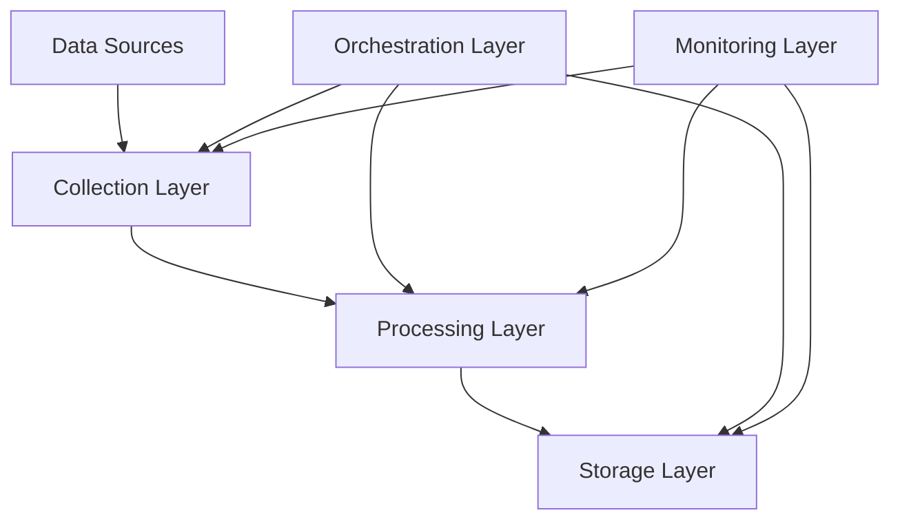

# Financial Time Series Data Pipeline

[](https://www.python.org/downloads/)
[](LICENSE)
[](https://github.com/psf/black)
[](https://docs.pytest.org/en/latest/)

A robust, scalable pipeline for collecting, processing, and storing financial market data from multiple sources. Built with Python, Apache Airflow, and InfluxDB.

## Features

- 📊 Multi-source data collection (Yahoo Finance, Alpha Vantage)
- 🔄 Real-time and batch processing capabilities
- 📈 Automated technical indicator calculation
- 💾 Scalable time-series data storage using InfluxDB
- 📡 Comprehensive monitoring and alerting system
- 🔄 Apache Airflow-based orchestration
- 🐳 Docker containerization
- ⚡ High performance and scalability

## Table of Contents

- [Requirements](#requirements)
- [Quick Start](#quick-start)
- [Installation](#installation)
- [Configuration](#configuration)
- [Usage](#usage)
- [Architecture](#architecture)
- [Development](#development)
- [Testing](#testing)
- [Deployment](#deployment)
- [Monitoring](#monitoring)
- [Contributing](#contributing)
- [License](#license)

## Requirements

- Python 3.9+
- Docker and Docker Compose
- Git
- Poetry (Python package manager)

## Quick Start

```bash
# Clone repository
git clone git@github.com:smaddanki/Financial-Time-Series-Data-Ingestion-Pipeline.git
cd Financial-Time-Series-Data-Ingestion-Pipeline

# Install dependencies
poetry install

# Set up environment
cp .env.example .env
# Edit .env with your configuration

# Start services
docker-compose up -d

# Run pipeline
poetry run python -m src.cli run-pipeline
```

## Installation

### Local Development Setup

1. Install Python dependencies:
```bash
poetry install
```

2. Install pre-commit hooks:
```bash
poetry run pre-commit install
```

3. Set up environment variables:
```bash
cp .env.example .env
# Edit .env with your configuration
```

### Docker Setup

1. Build and start services:
```bash
docker-compose up -d --build
```

2. Verify services are running:
```bash
docker-compose ps
```

## Configuration

### Environment Variables

Required environment variables:
```plaintext
ALPHA_VANTAGE_API_KEY=your_api_key
INFLUXDB_URL=http://localhost:8086
INFLUXDB_TOKEN=your_token
INFLUXDB_ORG=your_org
INFLUXDB_BUCKET=market_data
```

### Configuration Files

The pipeline uses YAML configuration files located in the `configs/` directory:

```yaml
# configs/development.yaml
environment: development
debug: true

data_sources:
  yahoo_finance:
    base_url: "https://query1.finance.yahoo.com/v8/finance/chart/"
    rate_limit: 2000
    timeout: 30
```

## Usage

### Command Line Interface

```bash
# Run pipeline for specific symbols
poetry run python -m src.cli run-pipeline --symbols AAPL,GOOGL

# Backfill historical data
poetry run python -m src.cli backfill --start-date 2024-01-01

# Monitor pipeline status
poetry run python -m src.cli status
```

### Airflow DAGs

Access the Airflow UI at http://localhost:8080:

1. Login with default credentials:
   - Username: admin
   - Password: admin

2. Enable and trigger the DAG:
   - DAG Name: financial_timeseries_pipeline
   - Schedule: Daily at midnight

## Architecture



### Components

- **Collection Layer**: Handles data acquisition from multiple sources
- **Processing Layer**: Data validation, cleaning, and technical analysis
- **Storage Layer**: Time-series data storage in InfluxDB
- **Orchestration Layer**: Workflow management with Apache Airflow
- **Monitoring Layer**: System health monitoring and alerting

## Development

### Project Structure

```
financial_timeseries_pipeline/
├── airflow/              # Airflow DAGs and plugins
├── configs/              # Configuration files
├── docs/                 # Documentation
├── notebooks/           # Jupyter notebooks
├── scripts/             # Utility scripts
├── src/                 # Source code
│   ├── pipeline/        # Core pipeline components
│   ├── utils/           # Utility functions
│   └── monitoring/      # Monitoring components
└── tests/               # Test suites
```

### Code Style

The project uses:
- Black for code formatting
- isort for import sorting
- flake8 for linting
- mypy for type checking

Run formatters:
```bash
poetry run black src/ tests/
poetry run isort src/ tests/
```

## Testing

Run tests using pytest:

```bash
# Run all tests
poetry run pytest

# Run specific test types
poetry run pytest tests/unit/
poetry run pytest tests/integration/
poetry run pytest tests/e2e/

# Run tests with coverage
poetry run pytest --cov=src tests/
```

## Deployment

### Production Deployment

1. Build production image:
```bash
docker build -t financial-pipeline:prod -f Dockerfile.prod .
```

2. Deploy to Kubernetes:
```bash
kubectl apply -f k8s/
```

### Monitoring Setup

1. Access monitoring dashboards:
   - Grafana: http://localhost:3000
   - Prometheus: http://localhost:9090

2. Configure alerts in `configs/alerts.yaml`

## Contributing

1. Fork the repository
2. Create a feature branch:
```bash
git checkout -b feature/your-feature-name
```

3. Make your changes and commit:
```bash
git commit -m "Add your feature"
```

4. Push to your fork:
```bash
git push origin feature/your-feature-name
```

5. Create a Pull Request

Please ensure your PR:
- Passes all tests
- Includes relevant tests
- Follows code style guidelines
- Updates documentation as needed


## Acknowledgments

- [Apache Airflow](https://airflow.apache.org/)
- [InfluxDB](https://www.influxdata.com/)
- [yfinance](https://github.com/ranaroussi/yfinance)
- [Alpha Vantage](https://www.alphavantage.co/)

