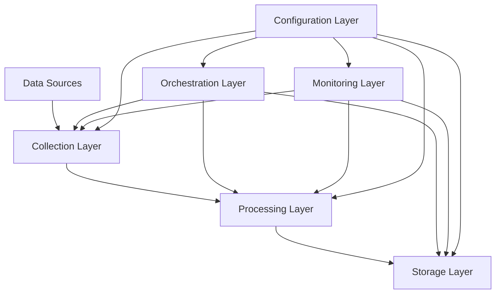

# Financial Time Series Data Pipeline

## Table of Contents
1. [Overview](#overview)
2. [System Architecture](#system-architecture)
3. [Installation Guide](#installation-guide)
4. [Configuration Guide](#configuration-guide)
5. [Usage Guide](#usage-guide)
6. [Monitoring and Maintenance](#monitoring-and-maintenance)
7. [API Reference](#api-reference)
8. [Development Guide](#development-guide)
9. [Troubleshooting](#troubleshooting)

## Overview

The Financial Time Series Data Pipeline is a robust, scalable system for collecting, processing, and storing financial market data from multiple sources. It supports real-time and batch processing, with comprehensive monitoring and error handling capabilities.

### Key Features
- Multi-source data collection (Yahoo Finance, Alpha Vantage)
- Real-time and batch processing
- Technical indicator calculation
- Scalable data storage using InfluxDB
- Comprehensive monitoring and alerting
- Airflow-based orchestration

### Technology Stack
- Python 3.9+
- Apache Airflow 2.7+
- InfluxDB 2.0+
- Docker & Docker Compose
- Poetry for dependency management

## System Architecture

### High-Level Architecture


### Component Details

1. **Collection Layer**
   - DataCollector class
   - Rate limiting
   - Source-specific adapters
   - Error handling

2. **Processing Layer**
   - Data validation
   - Missing value handling
   - Technical indicator calculation
   - Data normalization

3. **Storage Layer**
   - InfluxDB integration
   - Batch writing
   - Data point management
   - Retention policies

4. **Orchestration Layer**
   - Airflow DAGs
   - Task scheduling
   - Dependency management
   - Error recovery

5. **Monitoring Layer**
   - Metrics collection
   - Alert management
   - SLA monitoring
   - Performance tracking

## Installation Guide

### Prerequisites
```bash
# System requirements
Python 3.9+
Docker & Docker Compose
Git

# Optional tools
kubectl (for Kubernetes deployment)
helm (for Kubernetes deployment)
```

### Installation Steps

1. **Clone Repository**
```bash
git clone https://github.com/your-org/financial-timeseries-pipeline.git
cd financial-timeseries-pipeline
```

2. **Install Dependencies**
```bash
# Install Poetry
curl -sSL https://install.python-poetry.org | python3 -

# Install project dependencies
poetry install
```

3. **Environment Setup**
```bash
# Copy environment template
cp .env.example .env

# Edit environment variables
nano .env
```

4. **Start Services**
```bash
# Start all services
docker-compose up -d

# Verify services
docker-compose ps
```

5. **Initialize Airflow**
```bash
# Initialize the database
airflow db init

# Create admin user
airflow users create \
    --username admin \
    --firstname admin \
    --lastname admin \
    --role Admin \
    --email admin@example.com
```

## Configuration Guide

### Configuration Files

1. **Development Configuration**
```yaml
# configs/development.yaml
environment: development
debug: true

data_sources:
  yahoo_finance:
    base_url: "https://query1.finance.yahoo.com/v8/finance/chart/"
    rate_limit: 2000
    timeout: 30
```

2. **Production Configuration**
```yaml
# configs/production.yaml
environment: production
debug: false

data_sources:
  yahoo_finance:
    base_url: "https://query1.finance.yahoo.com/v8/finance/chart/"
    rate_limit: 5000
    timeout: 30
```

### Environment Variables
```plaintext
# .env
ALPHA_VANTAGE_API_KEY=your_key
INFLUXDB_URL=http://localhost:8086
INFLUXDB_TOKEN=your_token
INFLUXDB_ORG=your_org
INFLUXDB_BUCKET=market_data
```

## Usage Guide

### Running the Pipeline

1. **Manual Execution**
```bash
# Trigger DAG manually
airflow dags trigger financial_timeseries_pipeline

# Check status
airflow dags show financial_timeseries_pipeline
```

2. **Scheduled Execution**
```python
# DAG configuration
schedule_interval = '0 0 * * *'  # Daily at midnight
```

### Adding New Data Sources

1. **Implement Collector**
```python
def collect_new_source(self, symbol: str, start_date: datetime, 
                      end_date: datetime) -> pd.DataFrame:
    # Implementation
    pass
```

2. **Update Configuration**
```yaml
data_sources:
  new_source:
    base_url: "https://api.new-source.com"
    rate_limit: 1000
    timeout: 30
```

## Monitoring and Maintenance

### Monitoring Components

1. **Metrics Collection**
```python
# Example metrics collection
metrics.start_operation('collect_data', symbol)
metrics.end_operation(operation_id, success=True)
```

2. **Alerting**
```python
# Example alert
alerts.send_alert(
    level='warning',
    message='Pipeline issues detected',
    details={'issues': issues}
)
```

### Maintenance Tasks

1. **Database Maintenance**
```sql
-- InfluxDB retention policy
CREATE RETENTION POLICY "one_year"
ON "market_data"
DURATION 365d
REPLICATION 1
```

2. **Log Rotation**
```yaml
# airflow.cfg
log_rotation_days = 30
```

## API Reference

### DataCollector
```python
class DataCollector:
    """Collects financial data from various sources"""
    
    def collect_data(self, symbol: str, source: str, 
                    start_date: datetime, end_date: datetime) -> pd.DataFrame:
        """Collect data from specified source"""
```

### DataProcessor
```python
class DataProcessor:
    """Processes financial time series data"""
    
    def process_data(self, df: pd.DataFrame) -> pd.DataFrame:
        """Main data processing pipeline"""
```

### DataStorage
```python
class DataStorage:
    """Handles data storage in InfluxDB"""
    
    def store_data(self, df: pd.DataFrame, symbol: str) -> None:
        """Store data in InfluxDB"""
```

## Development Guide

### Project Structure
```
financial_timeseries_pipeline/
├── airflow/
│   └── dags/
├── configs/
├── src/
│   ├── pipeline/
│   ├── utils/
│   └── monitoring/
├── tests/
└── docs/
```

### Development Workflow

1. **Setup Development Environment**
```bash
# Create virtual environment
poetry shell

# Install development dependencies
poetry install --dev
```

2. **Run Tests**
```bash
# Run all tests
pytest tests/

# Run specific tests
pytest tests/unit/
pytest tests/integration/
```

3. **Code Style**
```bash
# Format code
black src/ tests/

# Check types
mypy src/

# Lint code
flake8 src/ tests/
```

## Troubleshooting

### Common Issues

1. **Data Collection Failures**
```python
# Check rate limits
rate_limiter.wait_if_needed()

# Verify API credentials
assert config['data_sources'][source]['api_key']
```

2. **Processing Errors**
```python
# Validate data
required_columns = ['timestamp', 'open', 'high', 'low', 'close']
assert all(col in df.columns for col in required_columns)
```

3. **Storage Issues**
```python
# Check InfluxDB connection
influxdb_client.ping()

# Verify write permissions
write_api.write(bucket=bucket, record=points)
```

### Logging

```python
# Configure logging
logging.basicConfig(
    level=logging.INFO,
    format='%(asctime)s - %(name)s - %(levelname)s - %(message)s'
)

# Example usage
logger.info(f"Processing data for {symbol}")
logger.error(f"Error collecting data: {e}")
```

### Monitoring Checks

1. **Health Checks**
```bash
# Check service health
curl http://localhost:8086/health

# Check Airflow health
airflow health
```

2. **Performance Monitoring**
```python
# Monitor processing time
start_time = time.time()
process_data(df)
duration = time.time() - start_time
```